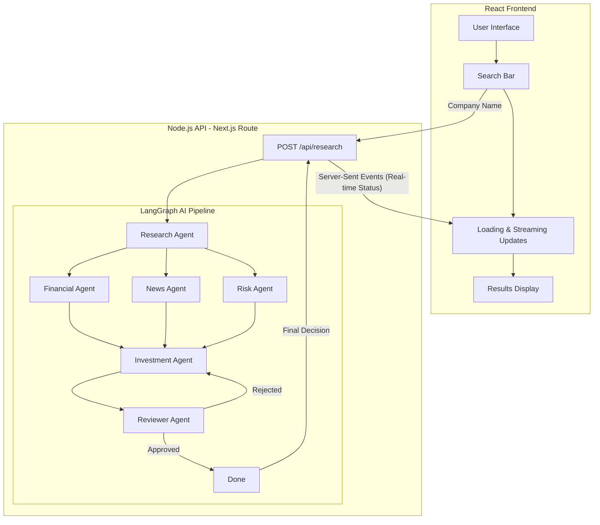

# InvestIQ — AI Investment Research Agent 🚀

**An AI-powered investment research agent that takes a company name, autonomously researches it using real-time web data, and delivers a comprehensive Invest or Pass recommendation.**

> **Note for InsideIIM Recruiters:** 
> Hi! I'm **Gaurav Tiwari**, and this is my submission for the **AI Engineer Intern** role at InsideIIM × Altuni AI Labs. I've poured a lot of passion into making this production-ready, featuring an advanced 6-agent LangGraph architecture, Supabase integration, and a premium mobile-responsive UI. 
> 
> *P.S. Don't forget to click the **"InsideIIM Recruiter?"** button on the home page for a special first impression! 😉*

     

---

## 🌟 Overview & Key Features

InvestIQ is a full-stack, enterprise-grade AI financial analyst. It completely automates the heavy lifting of stock research by scraping, analyzing, and structuring market data in under 30 seconds.

- **🤖 6-Agent LangGraph Pipeline**: A highly sophisticated directed graph of specialized AI agents:
  1. `Research Agent`: Fetches live web data.
  2. `Financial Agent`: Extracts metrics (Revenue, EPS, P/E).
  3. `News Agent`: Analyzes recent sentiment.
  4. `Risk Agent`: Assesses market/regulatory threats.
  5. `Investment Agent`: Formulates the final thesis.
  6. `Reviewer Agent`: Critiques the thesis to ensure maximum quality.
- **📊 Real-time Data**: Integrated with the Tavily Search API and Yahoo Finance for up-to-the-minute market accuracy.
- **🔐 User Auth & History**: Fully integrated with **Supabase** for secure authentication and persistent report history tracking.
- **📱 Premium Mobile-Responsive UI**: A highly polished, dark-mode first design utilizing `framer-motion` for micro-animations, glassmorphism, and Recharts for interactive data visualization.
- **📄 Export to PDF & JSON**: Download the generated institutional-grade reports with a single click.

---

## 🛠️ Architecture

The application follows a **Next.js full-stack architecture** where the React frontend communicates with a Node.js API route that orchestrates the AI agent pipeline. State is streamed back to the client in real-time via Server-Sent Events (SSE).



---

## 🚀 How to Run Locally

### Prerequisites
- **Node.js** >= 18.x
- **npm** >= 9.x
- **API Keys**

### Required Keys
| Key | Purpose |
|-----|---------|
| `GOOGLE_GEMINI_API_KEY` | Gemini 2.0 Flash LLM |
| `TAVILY_API_KEY` | Web search for real-time research |
| `NEXT_PUBLIC_SUPABASE_URL` | Supabase Database URL |
| `NEXT_PUBLIC_SUPABASE_ANON_KEY` | Supabase Public Anon Key |

### Setup Instructions

```bash
# 1. Clone the repository
git clone https://github.com/gauravtiwarrii/InsideIIM.git
cd InsideIIM

# 2. Install dependencies
npm install

# 3. Set up environment variables
#    Create a .env.local file in the root directory and add your keys:
echo "GOOGLE_GEMINI_API_KEY=your_key" > .env.local
echo "TAVILY_API_KEY=your_key" >> .env.local
echo "NEXT_PUBLIC_SUPABASE_URL=your_url" >> .env.local
echo "NEXT_PUBLIC_SUPABASE_ANON_KEY=your_key" >> .env.local

# 4. Start the development server
npm run dev
```

Open [http://localhost:3000](http://localhost:3000) in your browser.

---

## 📈 Tech Stack

| Component | Technology | Why |
|-----------|-----------|-----|
| **Framework** | Next.js 15 (App Router) | Full-stack React with API routes — single deployment unit |
| **LLM** | Google Gemini 2.0 Flash | Incredible speed, large context window, and native JSON structuring |
| **Web Search** | Tavily Search API | Purpose-built for AI agents, returns clean search results |
| **AI Framework** | LangChain.js + LangGraph.js | Industry standard for building cyclic, multi-agent AI pipelines |
| **Database & Auth** | Supabase | Instant PostgreSQL, secure sessions, and row-level security |
| **Styling** | Tailwind CSS + Framer Motion | Rapid, responsive styling with premium UI/UX micro-animations |

---

## 🎯 Example Outputs

### Nvidia (NVDA)
- **Decision**: INVEST ✅
- **Confidence**: 92%
- **Key Insight**: Absolute dominance in the AI hardware accelerator market. Unprecedented data center revenue growth and high switching costs due to CUDA software moat.

### Tesla (TSLA)
- **Decision**: HOLD ⚠️
- **Confidence**: 68%
- **Key Insight**: Market leader in EVs with expanding energy storage business, but faces increasing margin pressure and intense competition from BYD and other Chinese manufacturers.

---

Built with ❤️ by **Gaurav Tiwari** for **InsideIIM**.
