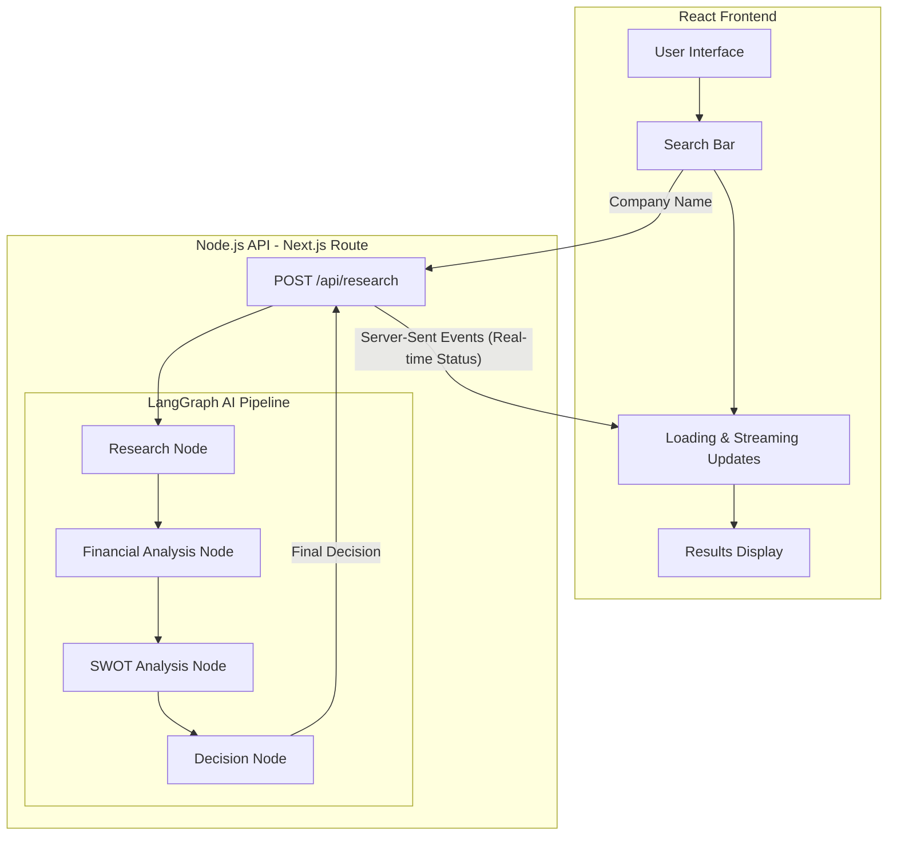
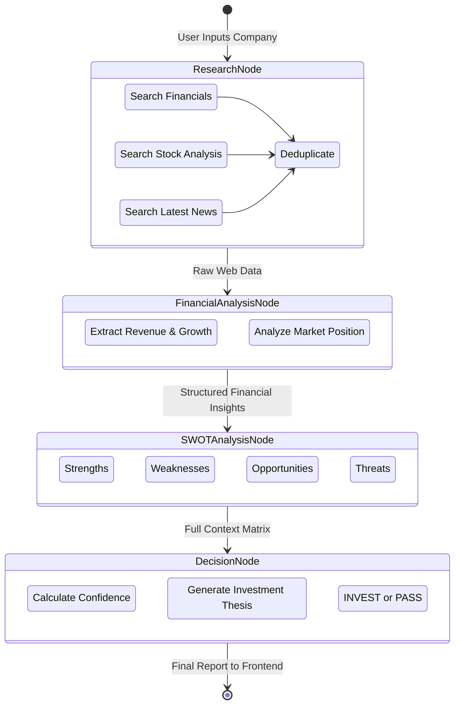

# AI Investment Research Agent

An AI-powered investment research agent that takes a company name, autonomously researches it using real-time web data, and delivers a comprehensive **Invest or Pass** recommendation with detailed reasoning, SWOT analysis, financial insights, and cited sources.

   

---

## Overview

This project is an **AI Investment Research Agent** built for the InsideIIM × Altuni AI Labs take-home assignment. It demonstrates how to build a real AI product, end to end — from data retrieval to intelligent analysis to a polished user experience.

**What it does:**
1. Takes a company name as input
2. Searches the web for recent financial news, stock performance, and company developments (via Tavily)
3. Analyzes the raw data to extract key financial metrics and insights (via Gemini)
4. Generates a SWOT analysis (Strengths, Weaknesses, Opportunities, Threats)
5. Makes a definitive **Invest** or **Pass** recommendation with a confidence score, reasoning, key factors, and risk assessment

---

## How to Run It

### Prerequisites
- **Node.js** >= 18.x
- **npm** >= 9.x
- **API Keys** (see below)

### Required API Keys
| Key | Purpose | Get it at |
|-----|---------|-----------|
| `NVIDIA_API_KEY` | NVIDIA NIM LLM (Llama 3.1 70B) | [NVIDIA NIM](https://build.nvidia.com/) |
| `TAVILY_API_KEY` | Web search for real-time research | [Tavily](https://tavily.com/) |

### Setup & Run

```bash
# 1. Clone the repository
git clone <repo-url>
cd InsideIIM

# 2. Install dependencies
npm install --legacy-peer-deps

# 3. Set up environment variables
#    Create a .env.local file in the root directory:
echo "NVIDIA_API_KEY=your-nvidia-api-key" > .env.local
echo "TAVILY_API_KEY=your-tavily-api-key" >> .env.local

# 4. Start the development server
npm run dev
```

Open [http://localhost:3000](http://localhost:3000) in your browser.

---

## How It Works

### Architecture

The application follows a **Next.js full-stack architecture** where the React frontend communicates with a Node.js API route that orchestrates the AI agent.

### Architecture

The application follows a **Next.js full-stack architecture** where the React frontend communicates with a Node.js API route that orchestrates the AI agent.



### Agent Pipeline Flow

The AI reasoning process is powered by a directed LangGraph pipeline with 4 distinct nodes executing sequentially:



1. **Research Node** — Executes 3 parallel Tavily searches to gather financial performance, stock analysis, and latest news about the company. Results are deduplicated by URL.
2. **Financial Analysis Node** — The Gemini LLM synthesizes raw search results into structured financial insights: revenue trends, profitability, debt levels, growth trajectory, and market position.
3. **SWOT Analysis Node** — Generates a comprehensive 4×4 SWOT matrix based on the research data and financial analysis.
4. **Decision Node** — Makes the final Invest/Pass recommendation with a confidence score, detailed thesis, key reasons, and risk factors.

### Real-Time Streaming

The API uses **Server-Sent Events (SSE)** to stream progress updates to the frontend. As each node completes, the user sees live status updates, creating a responsive experience even though the full analysis takes 15-30 seconds.

### Tech Stack

| Component | Technology | Why |
|-----------|-----------|-----|
| Framework | Next.js 16 (App Router) | Full-stack React with API routes — single deployment unit |
| LLM | NVIDIA NIM (Llama 3.1 70B) | Fast, accurate, great for structured JSON output via OpenAI-compatible API |
| Web Search | Tavily Search API | Purpose-built for AI agents, returns clean search results |
| AI Framework | LangChain.js + LangGraph.js | Industry standard for building LLM agent pipelines |
| Styling | Vanilla CSS | Full control over premium dark-mode design |

---

## Key Decisions & Trade-offs

### What I Chose and Why

1. **NVIDIA NIM Llama 3.1 70B over GPT-4o**: Fast response times and excellent structured JSON output via NVIDIA's OpenAI-compatible API endpoint, keeping total pipeline time under 30 seconds.

2. **SSE Streaming over WebSockets**: For a unidirectional data flow (server → client status updates), SSE is simpler and more appropriate than WebSockets. It also works natively with Next.js API routes.

3. **Sequential Pipeline over Parallel Nodes**: While financial analysis and SWOT could theoretically run in parallel, the SWOT analysis benefits from having the financial insights as additional context. Sequential execution produces better quality output.

4. **Multi-Query Search Strategy**: Instead of a single search, we run 3 targeted queries (financial performance, stock analysis, latest news) to get diverse, comprehensive data about the company.

5. **Vanilla CSS over Tailwind**: Full creative control over the premium dark-mode aesthetic with glassmorphism, gradients, and micro-animations.

### What I Left Out

- **User authentication / saved searches**: Not needed for the core demo
- **Historical comparison**: Comparing current data against historical performance would improve accuracy but requires a financial data API (e.g., Yahoo Finance API)
- **Portfolio tracking**: Could add the ability to save recommendations and track performance over time
- **Rate limiting**: Would be essential in production to prevent API abuse

---

## Example Runs

### Apple Inc.
- **Decision**: INVEST ✅
- **Confidence**: 85%
- **Key Insight**: Strong ecosystem lock-in, record services revenue, massive cash reserves, and continued innovation in AI/ML (Apple Intelligence)
- **Risk Factors**: China market uncertainty, regulatory pressure on App Store fees

### Tesla
- **Decision**: INVEST ✅ (with moderate conviction)
- **Confidence**: 65%
- **Key Insight**: Market leader in EVs with expanding energy storage business, but faces increasing competition and margin pressure
- **Risk Factors**: CEO distraction, rising competition from Chinese EVs, valuation premium

### Reliance Industries
- **Decision**: INVEST ✅
- **Confidence**: 78%
- **Key Insight**: Diversified conglomerate with strong growth in digital (Jio) and retail segments, traditional oil & gas provides stable cash flows
- **Risk Factors**: Succession planning, regulatory risks in telecom

---

## What I Would Improve With More Time

1. **Financial Data API Integration**: Integrate Yahoo Finance or Alpha Vantage API for precise stock prices, P/E ratios, market cap, and historical charts instead of relying solely on web search.

2. **Persistent History & Comparison**: Store past analyses in a database (Supabase/PostgreSQL) so users can compare recommendations over time and track accuracy.

3. **Multi-Agent Architecture**: Use LangGraph.js's full graph capabilities with parallel research agents specializing in different aspects (technical analysis, fundamental analysis, sentiment analysis).

4. **Interactive Charts**: Add Chart.js or D3.js visualizations for stock price history, revenue trends, and peer comparison.

5. **Export & Share**: PDF export of the investment report, shareable links.

6. **Caching Layer**: Redis cache for recent analyses to avoid redundant API calls and reduce costs.

7. **Authentication + Rate Limiting**: User accounts, API key management, and request throttling.

8. **Deployment on Vercel**: Production deployment with edge functions for faster cold starts.

---

## Project Structure

```
InsideIIM/
├── app/
│   ├── layout.tsx              # Root layout with metadata & fonts
│   ├── page.tsx                # Main page (search + results UI)
│   ├── globals.css             # Premium dark-mode design system
│   └── api/
│       └── research/
│           └── route.ts        # POST endpoint — runs AI agent via SSE
├── lib/
│   ├── agent.ts                # Core agent pipeline (4 nodes)
│   ├── tools.ts                # Tavily search tool configuration
│   ├── prompts.ts              # System prompts for each analysis node
│   └── types.ts                # TypeScript interfaces
├── .env.local                  # API keys (gitignored)
├── package.json
├── tsconfig.json
├── next.config.ts
└── README.md
```

---

## License

Built for the InsideIIM × Altuni AI Labs Take-Home Assignment.
